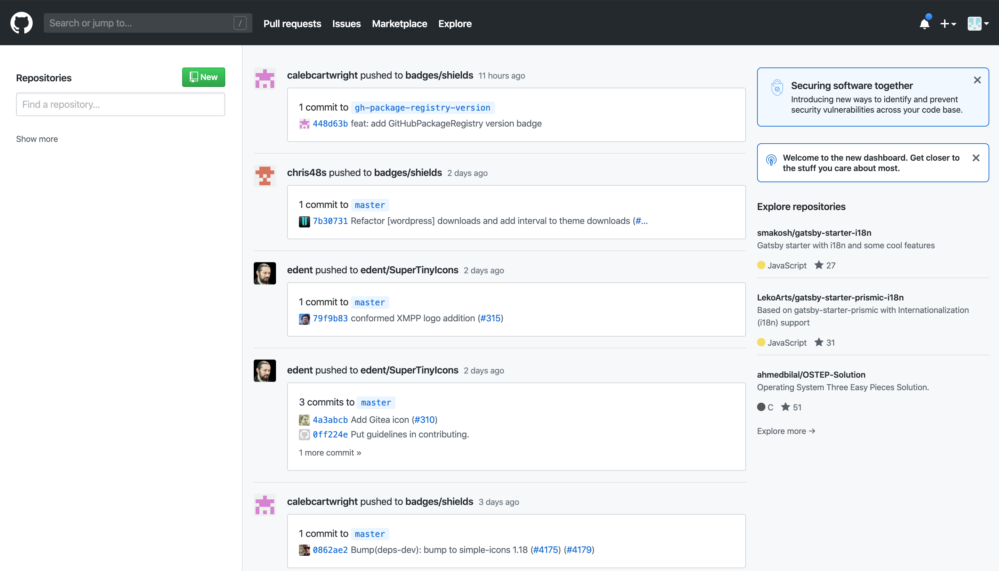
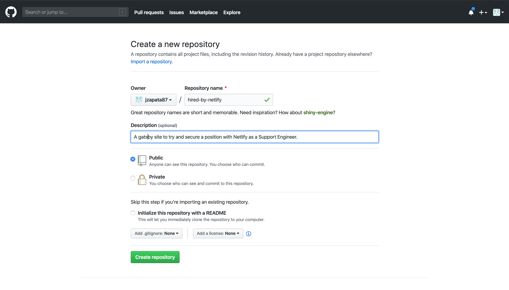
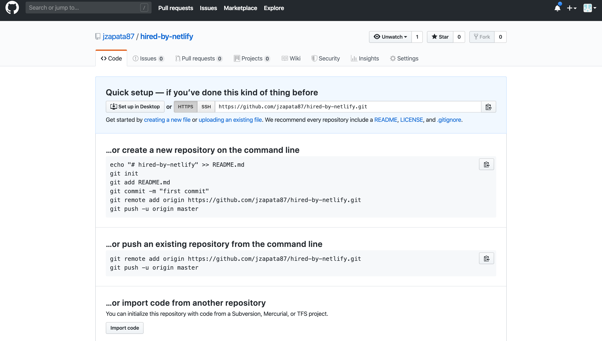
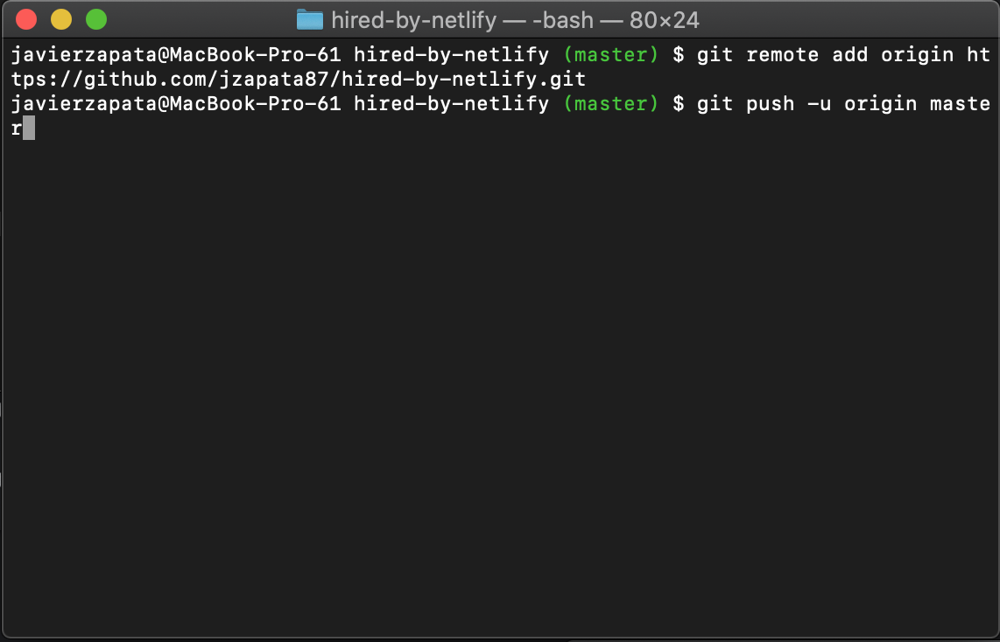
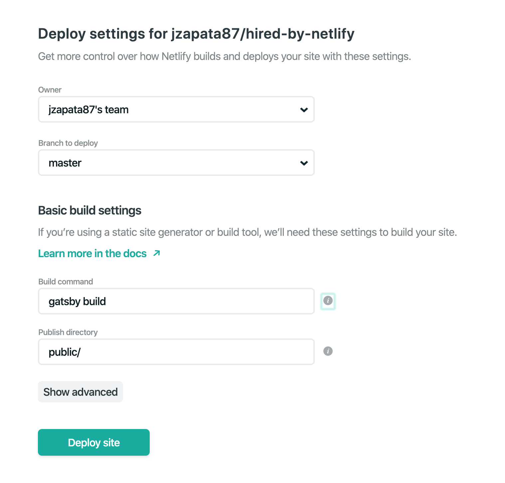
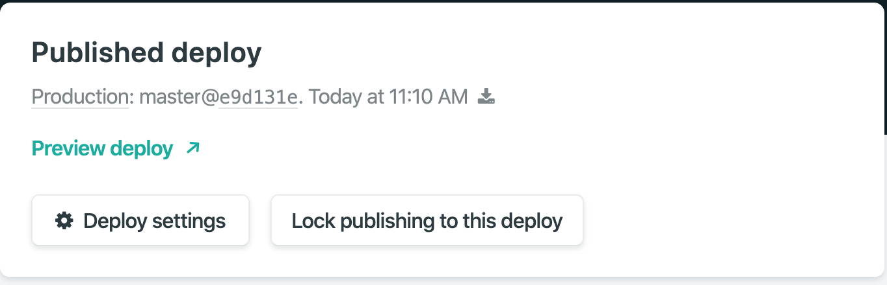

## Overview
There are really only 2 steps needed to complete our objective:
- Create a Github repo
- Deploy to Netlify

Of course there are more details but this is the gist.  I assume that you already have a Github and Netlify account.

## Create repo on Github

Go to Github.com and click on the "New" green button to create a new repository. This will take you to a new screen that will provide you some options to apply to your GitHub repository.  Name the repository.  The name you pick should be related to the gastby site you are going to host on Netlify.  This is just a preference to keep things nicely organized.  Of course you can name it whatever you like.



Continue to add a description to the site.  Choose to make it public.  DO NOT initialize with a readme, and make sure the options for .gitignore and license are set to none.  This is because when you actually connect your local repository on your computer, a merge conflict will occur.  Basically, things don't match up.  So to keep things simple just adjust the options to match what I have. Then click on the green "Create Repository" button.



You will then be sent to a screen with instructions on how to create a new, connect/push an existing or import another repo.  Since you have created a gatsby site (which should have been git init'ed if you used the gatsby clil) we will use the directions to "push an existing repository from the command line".



Open up your terminal and copy and past those statements into it and press enter.



## Deploy with Netlify

Now we will head over to Netlify.com and log in.  Click on the greenish "New site from Git button". Allow Netlify to get access to your GitHub account.  Install Netlify on your Github account.

You will then be taken to another screen where you are to follow the directions to get hosted by Netlify.  Since we are using Github, we will choose that.  Find and  select the repository that we just made.  Since this is a Gatsby site, I will use "gatsby build" as the build command.  I will leave the rest of the fields as is.  Then click deploy.



Now just wait while our site is building.  Once it is finished, click on "Preview Deploy" to see our site.



And it is just that simple.  This is the foundation of learning the JAMstack.  Please do some research on these new technologies.  I think people will be surprised on what they learn!

P.S If at any point there was some confusing, please leave a comment down below and I will get back to you with more clarity.  Thanks for reading!


<!-- ```jsx{numberLines: true}
// In your gatsby-config.js
plugins: [
  {
    resolve: `gatsby-transformer-remark`,
    options: {
      plugins: [
        `gatsby-remark-prismjs`,
        {
          resolve: `gatsby-remark-images`,
          options: {
            maxWidth: 740,
          },
        },
      ]
    }
  }
]

function Hero() {
  return (
    <Section
      bg="#1fc8db"

    >
      <ContentContainer width={[ 1, 1/2, 1/3, 1/4]} mx='auto'>
        <p>Hi</p>
      </ContentContainer>
    </Section>
  );
}
``` -->
